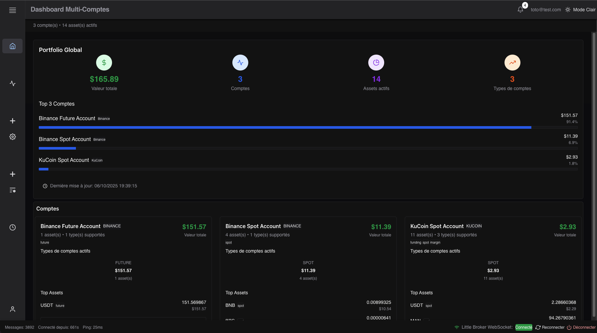
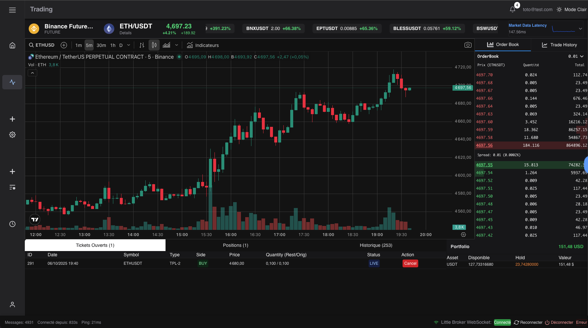
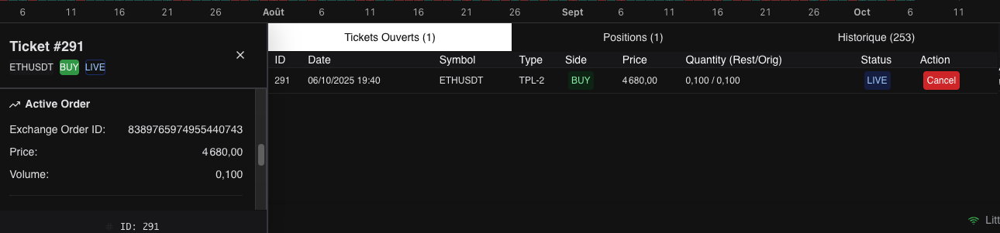
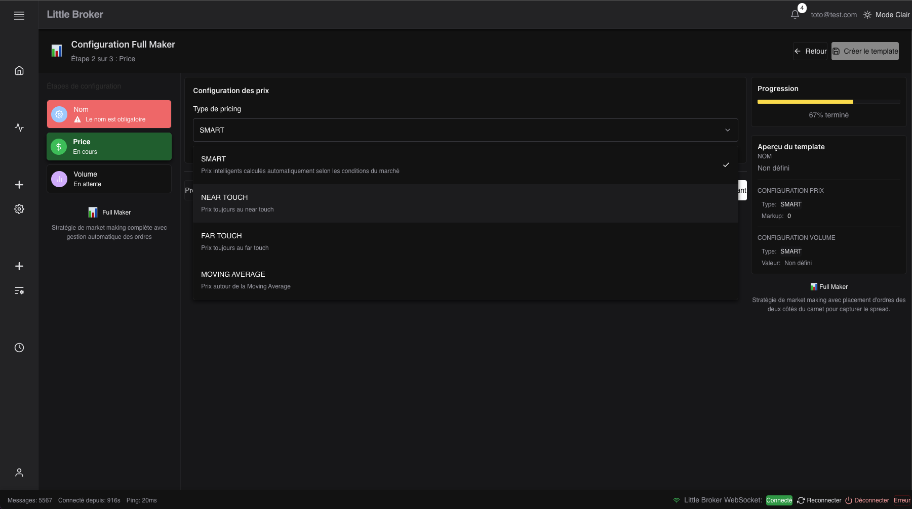
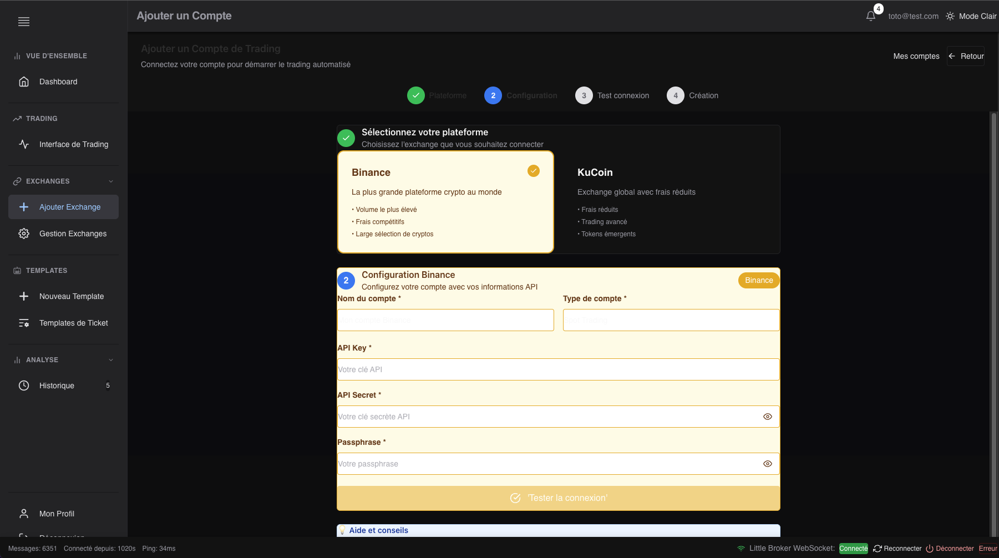
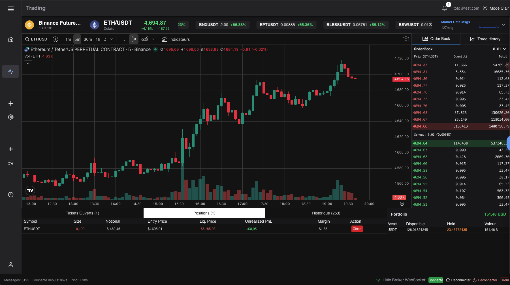

# AxoCrypto - Automated Trading Platform

## Table of Contents

1. [Overview](#overview)
2. [Functional Aspects](#functional-aspects)
   - [Dashboard](#1-dashboard)
   - [Trading Interface](#2-trading-interface)
   - [Template System](#3-template-system)
   - [Account Management](#4-account-management)
   - [Position Tracking](#5-position-tracking)
   - [Order History](#6-order-history)
3. [Technical Aspects](#technical-aspects)
   - [Global Architecture](#global-architecture)
   - [Frontend Tech Stack](#frontend-tech-stack)
   - [Backend Architecture](#backend-architecture)
   - [Execution Engine (Trader)](#execution-engine-trader)
   - [Inter-Process Communication](#inter-process-communication)
   - [Supported Exchanges](#supported-exchanges)
   - [Execution Strategies](#execution-strategies)
   - [Performance and Optimizations](#performance-and-optimizations)
   - [Deployment](#deployment)
3. [Improvement Areas](#improvement-areas)

---

## Overview

**AxoCrypto** is a comprehensive algorithmic trading platform for cryptocurrencies, composed of a modern web interface and a high-performance execution engine. The platform enables managing multiple exchange accounts and creating real-time execution strategies for various exchanges (Binance, KuCoin, etc.).
The goal is to optimize execution on personal accounts.

### Key Features

- **Multi-exchange trading**: Support for Binance (Spot & Futures) and KuCoin (Spot)
- **Automated strategies**: Template system for creating personalized execution strategies
- **High-performance execution**: Optimized execution engine with microsecond latency
- **Modern interface**: Web application with real-time data
- **Distributed architecture**: Independent components
- **Multi-tenancy**: Support for multiple accounts with complete isolation

---

## Functional Aspects

### 1. Dashboard

The dashboard provides a centralized view of the entire portfolio.

**Features:**
- **Global Portfolio View**: Total portfolio value aggregated across all accounts
- **Account Cards**: Individual summaries with balances and performance per account
- **Multi-Exchange Support**: Unified view of accounts from different exchanges
- **Asset Distribution**: Visualization of holdings distribution by asset
- **Real-Time Updates**: Live balance updates via WebSocket
- **Filtering**: Account filtering by exchange/venue

### 2. Trading Interface

Complete trading interface with real-time market data and advanced order management.

**Features:**
- **Real-Time Charts**: Interactive TradingView charts with multiple timeframes
- **Live Order Book**: Market depth visualization with clickable prices
- **Recent Trades Feed**: Live feed of recent market transactions
- **Quick Order Entry**: Simplified order submission panel with template support
- **Bot Monitoring**: Real-time visualization of bot status and their active orders, updated via Redis
- **Position Management**: Visualization and management of open positions (futures trading)
- **Market Analytics**: Real-time statistics (price changes, volume, ticker)
- **Multi-Account Support**: Switch between different exchange accounts and types (spot/futures)
- **Multi-Instrument Trading**: Quick symbol switching with search function

*These screenshots were taken on the development environment which is deployed on a Raspberry Pi cluster*

### 3. Template System

Powerful and flexible system for creating automated trading strategies via reusable templates.

**Template Types:**
- **Full Maker**: Market making strategy with customizable price and volume parameters
- **TWAP (Time-Weighted Average Price)**: Algorithmic execution distributing orders over time *(in development)*
- Extensible architecture allowing addition of new types

**Creation Features:**
- **Step-by-Step Wizard**: Intuitive multi-step configuration process
- **Real-Time Validation**: Field-level validation with immediate feedback
- **Visual Progress Tracking**: Progress indicators showing completion status
- **Template Preview**: Live preview of configuration
- **Template Management**: List, edit, duplicate and delete templates
- **Modular Architecture**: Generic system enabling easy addition of new strategy types

### 4. Account Management

Complete account and exchange integration management.

**Features:**
- **Exchange Integration**: Connection of multiple accounts (Binance, KuCoin, etc.)
- **API Key Management**: Secure storage and management of exchange credentials
- **Account Configuration**: Configuration of settings and preferences
- **Account Validation**: Testing and validation of API connections
- **Multi-Account Support**: Management of multiple accounts per exchange
- **Account Types**: Support for spot and futures accounts

### 5. Position Tracking

Real-time monitoring of positions and P&L (Profit & Loss).

**Features:**
- **Open Positions**: List of active futures positions
- **Real-Time P&L**: Live calculation of unrealized profits/losses
- **Liquidation Information**: Liquidation price and available margin
- **Notifications**: Real-time alerts via Redis Pub/Sub
- **Multi-Account Monitoring**: Consolidated view of positions across all accounts

### 6. Order History

Complete trade history across all accounts.

**Features:**
- **Complete History**: All executed trades
- **Advanced Filtering**: Search by symbol, date, account, type
- **Export**: Export functionality for external analysis
- **Trade Details**: Detailed information on each execution

---

## Technical Aspects

### Global Architecture

AxoCrypto uses a distributed microservices architecture:

**Separation of responsibilities:**
- **Web Frontend**: User interface and visualization
- **Backend API**: Account management, templates, authentication
- **Trader**: High-performance execution engine
- **Account Monitor**: Balance and position monitoring

**On-demand instantiation:**
- Trader and Account Monitor are instantiated at runtime on demand to reduce load and optimize resource utilization.
- Instantiation is done via configured account affinities. For a Binance account, the Trader will be instantiated in Japan.

### Frontend Tech Stack

#### Framework & Language
- **React 19**: Frontend framework with concurrent features
- **TypeScript**: Type-safe development
- **React Router v7**: Modern routing solution

#### UI & Styling
- **Chakra UI v3**: Modern component library
- **Emotion**: CSS-in-JS styling
- **React Icons**: Complete icon library
- **Recharts**: Data visualization

#### State Management
- **Context API**: Global state management (Auth, Trading Data)
- **React Hooks**: Component local state

#### Real-Time Communication
- **WebSocket**: Live market data and account updates
- **Custom WebSocket Provider**: Centralized WebSocket connection management

#### API & Data
- **Axios**: HTTP client for REST API calls
- **Little Broker API**: Backend service integration
- **Exchange APIs**: Direct integration with exchanges (Binance, KuCoin)

### Backend Architecture

**Technologies:**
- **FastAPI**: High-performance Python web framework
- **Redis**: Message broker and cache
- **PostgreSQL**: Relational database (persistence)
- **HashiCorp Vault** ensures secure storage and distribution of exchange API keys

**Responsibilities:**
- User account and exchange API key management
- Trading template CRUD
- Authentication and authorization
- Proxy for exchange APIs
- Event publishing in Redis Streams

### Execution Engine (Trader)

The **Trader** is the heart of the execution system, responsible for placing and managing orders in real-time.

#### Multi-Threaded Architecture

**2 main threads:**
- **Main Thread (Red Core)**: Consumes Redis tickets and executes strategies
- **Services Thread (Blue Core)**: Handles Redis streams, monitoring, logging

**Advantages:**
- Separation of critical paths (trading) and background (services)
- Configurable CPU pinning to avoid context switches
- Lock-free queues for inter-thread communication

#### Communication via Redis

**Protocols used:**
- **Redis Streams**: Reliable asynchronous communication between components
- **Redis Hashes**: Persistence of ticket/order/position state
- **Redis Pipeline**: Batch insertions to minimize network latency
- **Redis Pub/Sub**: Real-time notifications

### Supported Exchanges

#### Currently integrated

**KuCoin:**
- REST API + Public/Private WebSocket
- Authentication: API Key + Secret + Passphrase

**Binance:**
- REST API + User Data Stream WebSocket
- Authentication: API Key ED25519

### Performance and Optimizations

#### Technical Optimizations

**Threading:**
- Dual IO contexts (hot path trading + Redis services)
- Separation of concerns: critical latency vs background tasks

**CPU Pinning:**
- Processor affinity evaluated at runtime to adapt to server load
- Avoids context switches and cache invalidation

**Operating System Optimizations:**
- Hyperthreading disabled for deterministic performance
- Isolated CPU cores dedicated to Red Core (trading path)
- OS configuration optimized for minimal latency

**Lock-free Queues:**
- Zero allocation, zero contention

**SIMD Deserialization:**
- Optimized number conversion via SIMD for JSON parsing
- Reduced latency for parsing exchange messages

**Async I/O:**
- Boost.Asio C++20 coroutines
- No blocking calls in critical paths
- Automatic WebSocket reconnection

#### Benchmarks

- **Average tick-to-trade latency**: < 1μs (spin mode)
- **Redis pipeline throughput**: 10K+ messages/sec
- **WebSocket reconnection**: < 2s

### Monitoring and Observability

#### Monitoring Stack

- **Grafana**: Metrics visualization and custom dashboards
- **InfluxDB**: Time-series database for metrics storage
- **Loki**: Log aggregation and querying

#### Collected Metrics

**WebSocket Statistics:**
- Messages sent/received
- Average/max latency
- Error rates

**Process Monitoring:**
- Heartbeat (1 Hz)
- Status (`running`, `shutdown`)

**Trading Metrics:**
- Active tickets
- Orders placed/executed
- Traded volume

### Deployment

#### CI/CD with GitHub Actions

Deployment is automated via **GitHub Actions**:

- Automatic build of Docker images for each component (Trader, Feeder, Account Monitor, Backend)
- Push of images to a personal Docker registry
- Triggered on every commit to main branches

#### Process Management with HashiCorp Nomad

Execution and monitoring processes are orchestrated by **HashiCorp Nomad**:

**On-demand instantiation:**
- Execution (Trader) and monitoring (Account Monitor) processes are instantiated dynamically on demand
- Processes can be deployed geographically close to markets to minimize latency, even if the central system is hosted elsewhere

---

## Improvement Areas

### Future Optimizations

**SIMD Deserialization:**
- Implementation of a custom SIMD-based JSON deserializer for exchange messages (in progress)
- Optimization of WebSocket response parsing to further reduce latency

**Kernel Bypass:**
- Integration of kernel bypass libraries (DPDK, io_uring) for sockets
- Elimination of system calls for network I/O in the critical path
- Additional latency reduction for orders

**Direct Access Order**
- Implementation of exchange orders (market, limit, stop)

**New Order Templates:**
- Implementation of advanced algorithmic execution templates (parametric TWAP, VWAP, Iceberg)
- Extension of the template system to support more complex execution strategies
- Extension of the execution system via a scripting system (LUA, Python...) executed by the trader

---

**Note**: This is a personal project for purely personal use / learning / fun.