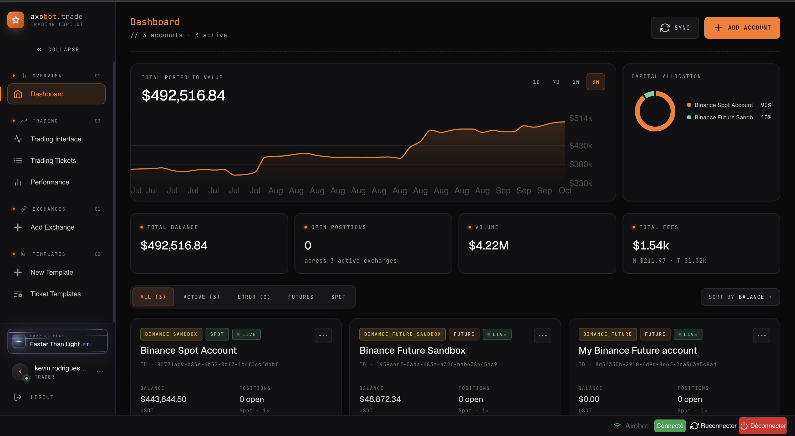
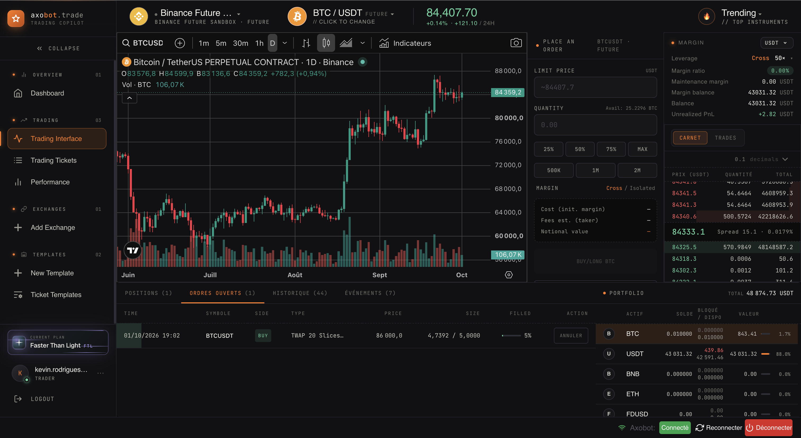
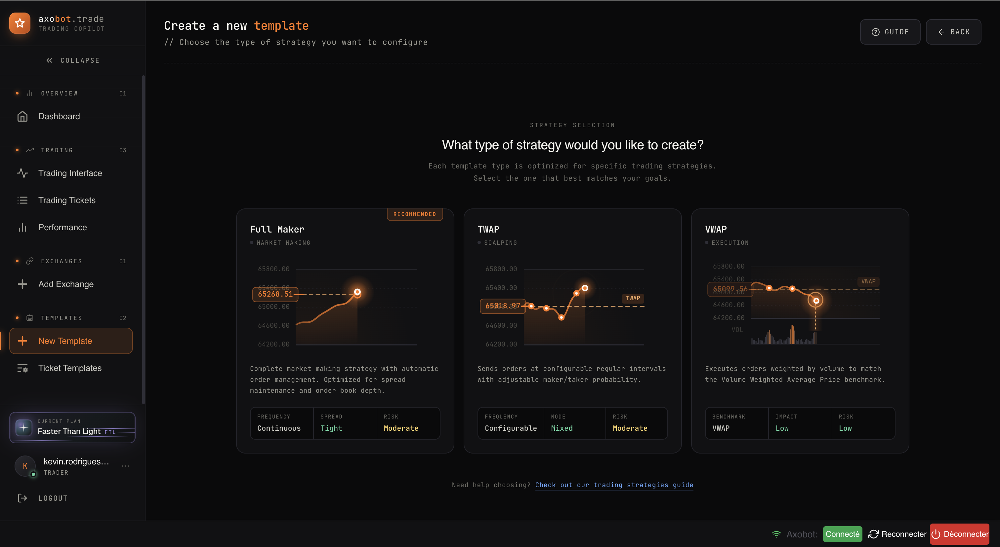
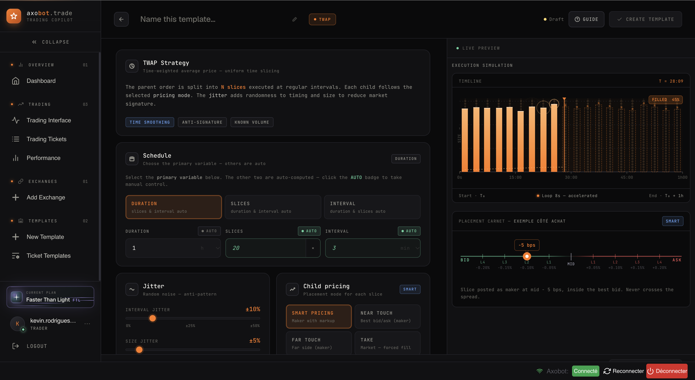
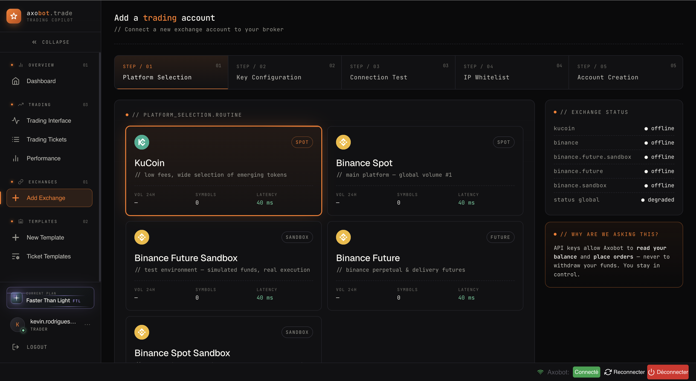
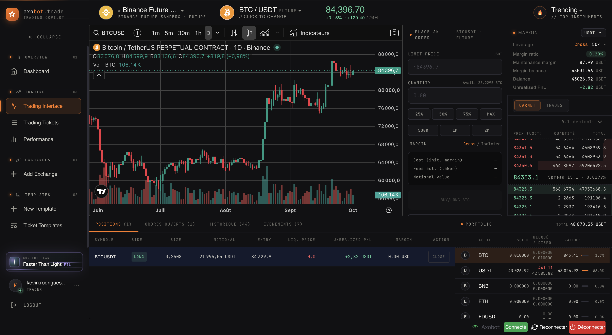
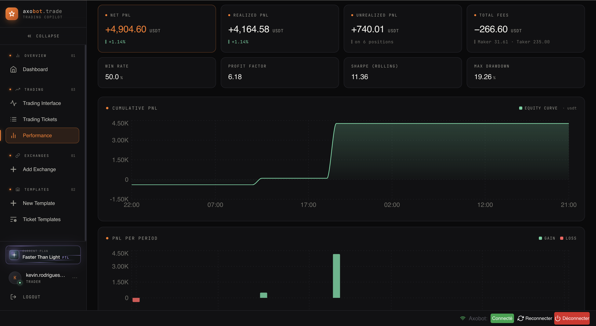

# Axobot - Automated Trading Platform

## Table of Contents

1. [Overview](#overview)
2. [Functional Aspects](#functional-aspects)
   - [Dashboard](#1-dashboard)
   - [Trading Interface](#2-trading-interface)
   - [Template System](#3-template-system)
   - [Account Management](#4-account-management)
   - [Position Tracking](#5-position-tracking)
   - [Order History](#6-order-history)
   - [Performance Overview](#7-performance-overview)
3. [Technical Aspects](#technical-aspects)
   - [Global Architecture](#global-architecture)
   - [Frontend Tech Stack](#frontend-tech-stack)
   - [Backend Architecture](#backend-architecture)
   - [Execution Engine (Trader)](#execution-engine-trader)
   - [Supported Exchanges](#supported-exchanges)
   - [Performance and Optimizations](#performance-and-optimizations)
   - [Monitoring and Observability](#monitoring-and-observability)
   - [Deployment](#deployment)
4. [Improvement Areas](#improvement-areas)

---

## Overview

**Axobot** is a comprehensive algorithmic trading platform for cryptocurrencies, composed of a modern web interface and a high-performance execution engine. The platform enables managing multiple exchange accounts and creating real-time execution strategies for various exchanges (Binance, KuCoin, etc.).
The goal is to optimize execution on personal accounts.

### Key Features

- **Multi-exchange trading**: Support for Binance (Spot & Futures, including sandboxes) and KuCoin (Spot)
- **Execution templates**: Full Maker, TWAP and VWAP strategies, fully configurable
- **Manual trading**: Direct limit orders and one-click position closing
- **Performance analytics**: PnL, fees and risk metrics per account over any time range
- **High-performance execution**: Optimized execution engine with sub-microsecond latency
- **Modern interface**: Web application with real-time data
- **Distributed architecture**: Independent components
- **Multi-tenancy**: Support for multiple accounts with complete isolation

---

## Functional Aspects

### 1. Dashboard

The dashboard provides a centralized view of the entire portfolio.

**Features:**
- **Portfolio Value History**: Total portfolio value aggregated across all accounts, with a history chart (1D / 7D / 1M / 3M)
- **Capital Allocation**: Breakdown of capital per account
- **Key Metrics**: Total balance, open positions, traded volume and total fees (maker / taker split)
- **Account Cards**: Per-account summary with venue, account type (spot/future), live status, balance and open positions
- **Filtering & Sorting**: Filter accounts by status (active, error) or type (futures, spot), sort by balance
- **Real-Time Updates**: Live balance updates via WebSocket, with manual sync
- **Quick Actions**: Add a new exchange account directly from the dashboard

### 2. Trading Interface

Complete trading interface with real-time market data, manual order entry and execution monitoring.

**Features:**
- **Account & Instrument Selection**: Switch between exchange accounts (spot/futures) and instruments, with a "Trending" panel listing top instruments
- **Real-Time Charts**: Interactive TradingView charts with multiple timeframes and indicators
- **Order Entry**: Limit orders with quantity presets (25% / 50% / 75% / Max) or fixed notional presets, Cross / Isolated margin, and estimated cost, fees and notional value before submission
- **Margin Panel**: Leverage, margin ratio, maintenance margin, margin balance and unrealized PnL (futures)
- **Live Order Book**: Market depth with configurable price grouping and live spread, plus a recent trades feed
- **Execution Monitoring**: Bottom panel with Positions, Open Orders (including running bot tickets), History and Events tabs, updated in real time via Redis
- **Portfolio Panel**: Per-asset balance, locked / available amounts, value and allocation
- **Connection Status**: Live status of the connection to the Axobot backend, with reconnect / disconnect controls

*A TWAP ticket split into 20 slices being executed: fill progress is tracked live and the ticket can be cancelled at any time.*

*These screenshots were taken on the development environment which is deployed on a Raspberry Pi cluster.*

### 3. Template System

Powerful and flexible system for creating automated execution strategies via reusable templates.

**Template Types:**
- **Full Maker**: Complete market making strategy with automatic order management, optimized for spread maintenance and order book depth
- **TWAP (Time-Weighted Average Price)**: Sends orders at configurable regular intervals with adjustable maker/taker behavior
- **VWAP (Volume-Weighted Average Price)**: Executes orders weighted by volume to match the VWAP benchmark
- Extensible architecture allowing addition of new types

**Configuration Features (TWAP example):**
- **Schedule**: Pick the primary variable (duration, number of slices or interval); the other two are computed automatically and can be overridden manually
- **Jitter**: Random noise on interval and slice size (±%) to avoid leaving a detectable execution signature
- **Child Pricing**: Placement mode for each slice — Smart Pricing (maker with markup), Near Touch, Far Touch or Take (market, forced fill)
- **Live Preview**: Execution simulation on a timeline, and visualization of where each slice is placed in the order book relative to mid (in bps)
- **Drafts & Guide**: Templates can be saved as drafts, with a built-in strategy guide
- **Template Management**: List, edit, duplicate and delete templates
- **Modular Architecture**: Generic system enabling easy addition of new strategy types

### 4. Account Management

Complete account and exchange integration management.

**Features:**
- **Step-by-Step Onboarding**: 5-step wizard — Platform Selection, Key Configuration, Connection Test, IP Whitelist, Account Creation
- **Supported Platforms**: KuCoin Spot, Binance Spot, Binance Future, plus Binance Spot and Future sandboxes
- **Exchange Status**: Live availability of each venue
- **API Key Management**: Secure storage of exchange credentials in HashiCorp Vault; keys are only used to read balances and place orders, never to withdraw funds
- **Multi-Account Support**: Management of multiple accounts per exchange
- **Account Types**: Support for spot and futures accounts

### 5. Position Tracking

Real-time monitoring of positions and P&L (Profit & Loss), available in the Positions tab of the trading interface.

**Features:**
- **Open Positions**: Active futures positions with side, size, notional and entry price
- **Real-Time P&L**: Live calculation of unrealized profits/losses
- **Liquidation Information**: Liquidation price and position margin
- **One-Click Close**: Close a position directly from the table
- **Notifications**: Real-time updates via Redis Pub/Sub

### 6. Order History

Trade history and execution events, available in the History and Events tabs of the trading interface.

**Features:**
- **Complete History**: All executed trades
- **Execution Events**: Ticket lifecycle events emitted by the execution engine
- **Trade Details**: Detailed information on each execution

### 7. Performance Overview

Performance analysis of a selected account over a chosen time range.

**Features:**
- **Account & Time Range Selection**: Compute performance for any account over a custom period
- **PnL Breakdown**: Net PnL, realized PnL and unrealized PnL (with open positions count), in absolute value and percentage
- **Fees**: Total fees paid, split between maker and taker
- **Risk & Quality Metrics**: Win rate, profit factor, rolling Sharpe ratio and max drawdown
- **Cumulative PnL**: Equity curve over the selected period
- **PnL per Period**: Gain / loss histogram per time bucket

---

## Technical Aspects

### Global Architecture

Axobot uses a distributed microservices architecture:

**Separation of responsibilities:**
- **Web Frontend**: User interface and visualization
- **Backend API**: Account management, templates, authentication
- **Trader**: High-performance execution engine
- **Account Monitor**: Balance and position monitoring

**On-demand instantiation:**
- Trader and Account Monitor are instantiated at runtime on demand to reduce load and optimize resource utilization.
- Instantiation is done via configured account affinities. For a Binance account, the Trader will be instantiated in Japan.

### Frontend Tech Stack

#### Framework & Language
- **React 19**: Frontend framework with concurrent features
- **TypeScript**: Type-safe development
- **React Router v7**: Modern routing solution

#### UI & Styling
- **Chakra UI v3**: Modern component library
- **Emotion**: CSS-in-JS styling
- **React Icons**: Complete icon library
- **Recharts**: Data visualization

#### State Management
- **Context API**: Global state management (Auth, Trading Data)
- **React Hooks**: Component local state

#### Real-Time Communication
- **WebSocket**: Live market data and account updates
- **Custom WebSocket Provider**: Centralized WebSocket connection management

#### API & Data
- **Axios**: HTTP client for REST API calls
- **Little Broker API**: Backend service integration
- **Exchange APIs**: Direct integration with exchanges (Binance, KuCoin)

### Backend Architecture

**Technologies:**
- **FastAPI**: High-performance Python web framework
- **Redis**: Message broker and cache
- **PostgreSQL**: Relational database (persistence)
- **HashiCorp Vault** ensures secure storage and distribution of exchange API keys

**Responsibilities:**
- User account and exchange API key management
- Trading template CRUD
- Authentication and authorization
- Proxy for exchange APIs
- Event publishing in Redis Streams

### Execution Engine (Trader)

The **Trader** is the heart of the execution system, responsible for placing and managing orders in real-time.

#### Multi-Threaded Architecture

**2 main threads:**
- **Main Thread (Red Core)**: Consumes Redis tickets and executes strategies
- **Services Thread (Blue Core)**: Handles Redis streams, monitoring, logging

**Advantages:**
- Separation of critical paths (trading) and background (services)
- Configurable CPU pinning to avoid context switches
- Lock-free queues for inter-thread communication

#### Communication via Redis

**Protocols used:**
- **Redis Streams**: Reliable asynchronous communication between components
- **Redis Hashes**: Persistence of ticket/order/position state
- **Redis Pipeline**: Batch insertions to minimize network latency
- **Redis Pub/Sub**: Real-time notifications

### Supported Exchanges

#### Currently integrated

**KuCoin:**
- REST API + Public/Private WebSocket
- Authentication: API Key + Secret + Passphrase

**Binance:**
- Spot & Futures, plus sandbox environments for both
- REST API + User Data Stream WebSocket
- Authentication: API Key ED25519

### Performance and Optimizations

#### Technical Optimizations

**Threading:**
- Dual IO contexts (hot path trading + Redis services)
- Separation of concerns: critical latency vs background tasks

**CPU Pinning:**
- Processor affinity evaluated at runtime to adapt to server load
- Avoids context switches and cache invalidation

**Operating System Optimizations:**
- Hyperthreading disabled for deterministic performance
- Isolated CPU cores dedicated to Red Core (trading path)
- OS configuration optimized for minimal latency

**Lock-free Queues:**
- Zero allocation, zero contention

**SIMD Deserialization:**
- Optimized number conversion and JSON parsing via SIMD: [faster-parser](https://github.com/Kakikou/faster-parser)
- Reduced latency for parsing exchange messages

**Async I/O:**
- Boost.Asio C++20 coroutines
- No blocking calls in critical paths
- Automatic WebSocket reconnection

#### Benchmarks

- **p99 tick-to-trade latency**: < 800ns (spin mode on Raspberry Pi 4)
- **Redis pipeline throughput**: 10K+ messages/sec
- **WebSocket reconnection**: < 2s

### Monitoring and Observability

#### Monitoring Stack

- **Grafana**: Metrics visualization and custom dashboards
- **InfluxDB**: Time-series database for metrics storage
- **Loki**: Log aggregation and querying

#### Collected Metrics

**WebSocket Statistics:**
- Messages sent/received
- Percentiles latency
- Error rates

**Process Monitoring:**
- Heartbeat (1 Hz)
- Status (`running`, `shutdown`)

**Trading Metrics:**
- Active tickets
- Orders placed/executed
- Traded volume

### Deployment

#### CI/CD with GitHub Actions

Deployment is automated via **Ansible** and **GitHub Actions**:

- Automatic build of Docker images for each component (Trader, Feeder, Account Monitor, Backend)
- Push of images to a personal Docker registry
- Cloud machines prepared via Ansible and joined as new nodes to the **Docker Swarm** cluster

#### Process Management with Docker Swarm

Execution and monitoring processes are orchestrated by **Docker Swarm**:

**On-demand instantiation:**
- Execution (Trader) and monitoring (Account Monitor) processes are instantiated dynamically on demand
- Processes can be deployed geographically close to markets to minimize latency, even if the central system is hosted elsewhere

---

## Improvement Areas

### Future Optimizations

**SIMD Deserialization:**
- Extend [faster-parser](https://github.com/Kakikou/faster-parser) coverage to all exchange messages
- Optimization of WebSocket response parsing to further reduce latency

**Kernel Bypass:**
- Integration of kernel bypass libraries (DPDK, io_uring) for sockets
- Elimination of system calls for network I/O in the critical path
- Additional latency reduction for orders

**New Order Templates:**
- Implementation of additional algorithmic execution templates (Iceberg, ...)
- Extension of the template system to support more complex execution strategies
- Extension of the execution system via a scripting system (LUA, Python...) executed by the trader

---

**Note**: This is a personal project for purely personal use / learning / fun.